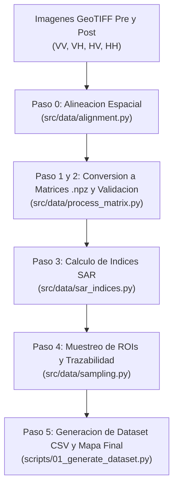

# Documentacion Tecnica: Pipeline de Procesamiento de Datos e Indices SAR

## 1. Resumen Ejecutivo

Este documento describe la arquitectura y el funcionamiento del pipeline de procesamiento de datos satelitales de Radar de Apertura Sintetica (SAR) para la construccion de datasets destinados al entrenamiento de modelos de aprendizaje automatico en la deteccion de areas quemadas por incendios forestales.

El pipeline procesa imagenes GeoTIFF de entrada (correspondientes a adquisiciones Pre y Post incendio en diversas polarizaciones), garantiza la alineacion espacial exacta entre coberturas, convierte los rasters a matrices numéricas comprimidas, calcula 10 caracteristicas derivadas y permite el muestreo georreferenciado de Regiones de Interes (ROIs) para la generacion de archivos CSV etiquetados.

---

## 2. Diagrama de Arquitectura del Pipeline



---

## 3. Descripcion Detallada de las Etapas

### Paso 0: Alineacion Espacial de imagenes Georreferenciadas (`src/data/alignment.py`)

Dado que las coberturas SAR adquiridas en distintas fechas o modulos orbitales pueden presentar ligeras discrepancias en extension y grilla de pixeles, esta etapa realiza un ajuste espacial estricto mediante la libreria `rasterio`:

1. **Lectura de Metadatos**: Se leen los limites geograficos (`bounds`), la matriz de transformacion afin (`transform`) y el sistema de referencia de coordenadas (`crs`) de cada archivo GeoTIFF.
2. **Interseccion Geografica**: Se calcula el rectangulo de interseccion comun entre todas las imagenes Pre y Post incendio:
   $$\text{left} = \max(\text{left}_i), \quad \text{bottom} = \max(\text{bottom}_i)$$
   $$\text{right} = \min(\text{right}_i), \quad \text{top} = \min(\text{top}_i)$$
3. **Recorte y Resampleo**: Se recortan todas las coberturas al tamano comun minimo $(W_{\min} \times H_{\min})$ en pixeles manteniendo el geotransform de referencia, garantizando coincidencia espacial pixel a pixel.

### Paso 1 y 2: Conversion a Matrices Numericas y Validacion (`src/data/process_matrix.py`)

1. **Conversion a NumPy**: Cada banda raster recortada se convierte a una matriz de punto flotante de doble precision (`float64`) representando los valores de retrodispersion ($\sigma^0$).
2. **Almacenamiento Comprimido**: Las matrices se guardan en la carpeta `Matrixs/` como archivos `.npz` comprimidos bajo la clave `'band'`.
3. **Validacion Dimensional**: La funcion `validate_all_matrix_dimensions()` inspecciona todas las matrices generadas en `Matrixs/` y valida que compartan exactamente las mismas dimensiones $(H \times W)$.

### Paso 3: Calculo de Indices Espectrales SAR (`src/data/sar_indices.py`)

A partir de las matrices primarias de retrodispersion, se computan 10 matrices derivadas utilizando operaciones matriciales directas. Se incorpora un termino constante $\epsilon = 10^{-10}$ para evitar divisiones por cero.

#### 1. Indice Radar de Vegetacion (IRV)
Calculado para estados Pre y Post incendio:
$$\text{IRV} = \text{clip}\left( \frac{8 \cdot \text{HV}}{\text{HH} + \text{VV} + 2 \cdot \text{HV} + \epsilon}, \, 0, \, 20 \right)$$

#### 2. Indice Normalizado de Polarizacion (NDPI)
Calculado para estados Pre y Post incendio:
$$\text{NDPI} = \text{clip}\left( \frac{\text{VV} - \text{HV}}{\text{VV} + \text{HV} + \epsilon}, \, -1, \, 1 \right)$$

#### 3. Indice Normalizado de Estructura / Suelo (NDBI)
Calculado para estados Pre y Post incendio:
$$\text{NDBI} = \text{clip}\left( \frac{\text{VV} - \text{VH}}{\text{VV} + \text{VH} + \epsilon}, \, -1, \, 1 \right)$$

#### 4. Ratio Relativizado de Quemado (RBR)
Calculado para las coberturas VV, VH y NDBI:
$$\text{RBR} = \text{clip}\left( \frac{\text{Post}}{\text{Pre} + \epsilon}, \, 0, \, 10 \right)$$

#### 5. Diferencial Normalizado
Calculado para las coberturas VV, VH y NDBI:
$$\text{Normalized} = \text{clip}\left( \frac{\text{Post} - \text{Pre}}{\text{Post} + \text{Pre} + \epsilon}, \, -1, \, 1 \right)$$

---

## 4. Muestreo de Regiones de Interes y Dataset CSV (`src/data/sampling.py`)

### Trazabilidad de Muestras (`selected_zones.json`)
Cada rectangulo delimitado por el operador $(x_1, y_1, x_2, y_2)$ se registra en un archivo JSON junto a su clasificacion y marca temporal, garantizando la reproducibilidad de la muestra.

### Esquema del Dataset Tabulado
Para cada pixel dentro de la region muestreada, se extraen los valores correspondientes de las 20 matrices de caracteristicas y se asigna la etiqueta de clasificacion.

El archivo CSV resultante contiene exactamente **21 columnas**:

| Num | Nombre de Columna | Tipo de Dato | Descripcion |
|---|---|---|---|
| 1 | `NDPI_Pre` | float64 | Indice NDPI pre incendio |
| 2 | `NDPI_Post` | float64 | Indice NDPI post incendio |
| 3 | `NDBI_Pre` | float64 | Indice NDBI pre incendio |
| 4 | `NDBI_Post` | float64 | Indice NDBI post incendio |
| 5 | `NORMALIZED_NDBI` | float64 | Variacion normalizada de NDBI |
| 6 | `NORMALIZED_VV` | float64 | Variacion normalizada de banda VV |
| 7 | `NORMALIZED_VH` | float64 | Variacion normalizada de banda VH |
| 8 | `RBR_NDBI` | float64 | Ratio RBR sobre NDBI |
| 9 | `RBR_VV` | float64 | Ratio RBR sobre banda VV |
| 10 | `RBR_VH` | float64 | Ratio RBR sobre banda VH |
| 11 | `HH_Pre` | float64 | Retrodispersion HH pre incendio |
| 12 | `HV_Pre` | float64 | Retrodispersion HV pre incendio |
| 13 | `VH_Pre` | float64 | Retrodispersion VH pre incendio |
| 14 | `VV_Pre` | float64 | Retrodispersion VV pre incendio |
| 15 | `HH_Post` | float64 | Retrodispersion HH post incendio |
| 16 | `HV_Post` | float64 | Retrodispersion HV post incendio |
| 17 | `VH_Post` | float64 | Retrodispersion VH post incendio |
| 18 | `VV_Post` | float64 | Retrodispersion VV post incendio |
| 19 | `IRV_Pre` | float64 | Indice IRV pre incendio |
| 20 | `IRV_Post` | float64 | Indice IRV post incendio |
| 21 | `Burn_Classification` | int64 | Clase objetivo: `0` (Not_Burned), `1` (Burned), `2` (Semiburned) |

---

## 5. Script de Ejecucion (`scripts/01_generate_dataset.py`)

La ejecucion del pipeline se realiza mediante el script principal `scripts/01_generate_dataset.py`.

### Opcion A: Ejecucion interactiva (Recomendado para uso general)

Al ejecutar el script directamente sin parametros de linea de comandos, la consola solicitara de forma guiada los datos requeridos para la trazabilidad antes de desplegar la ventana de seleccion de regiones:

```bash
python scripts/01_generate_dataset.py
```

**Prompts interactivos en consola**:
1. `Ingrese el nombre identificador de la prueba para trazabilidad (por defecto 'Prueba_Muestra'):`
   *Permite asignar un nombre personalizado (ej: `2026-09-05_Ponton_Exp01`) para aislar los resultados.*
2. `Ingrese la cantidad de poligonos/zonas a seleccionar (por defecto 1):`
   *Permite definir cuantos rectangulos ROI se marcaran interactivamente en la imagen.*

### Opcion B: Ejecucion parametrizada por linea de comandos (CLI)

Para automatizar la ejecucion o procesar un incendio/experimento especifico sin prompts interactivos:

```bash
python scripts/01_generate_dataset.py --proyecto "data/raw/Los_Alerces" --prueba "2026-09-05_LosAlerces_Exp01" --muestras 3
```

**Parametros CLI disponibles**:
- `--proyecto`: Ruta al directorio del incendio que contiene las carpetas `Images/Pre` e `Images/Post`.
- `--prueba`: Nombre identificador de la prueba para trazabilidad de carpetas.
- `--muestras`: Cantidad entera de poligonos a seleccionar.

### Estructura de Salida de Archivos

Al completar la ejecucion de una prueba, el sistema genera la siguiente estructura en la carpeta de destino:

```text
data/raw/<Incendio>/Pruebas/<Nombre_Prueba>/
├── csvs/
│   ├── vectors_output_<x1>_<x2>_<y1>_<y2>_<clase>.csv
│   └── datasetTotal_<proyecto>_<prueba>.csv
├── Imagenes_Utilizadas/
│   ├── Pre/
│   └── Post/
├── Matrices_Utilizadas/
│   └── *.npz
├── selected_zones.json
└── zonas_seleccionadas.png
```
