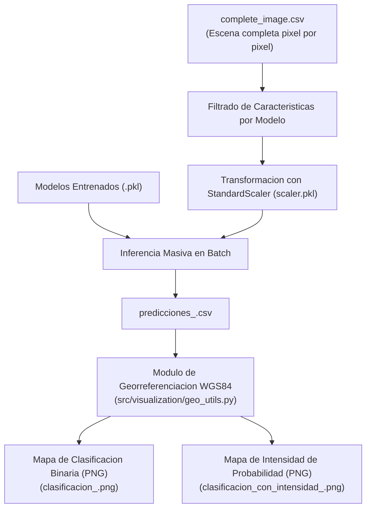
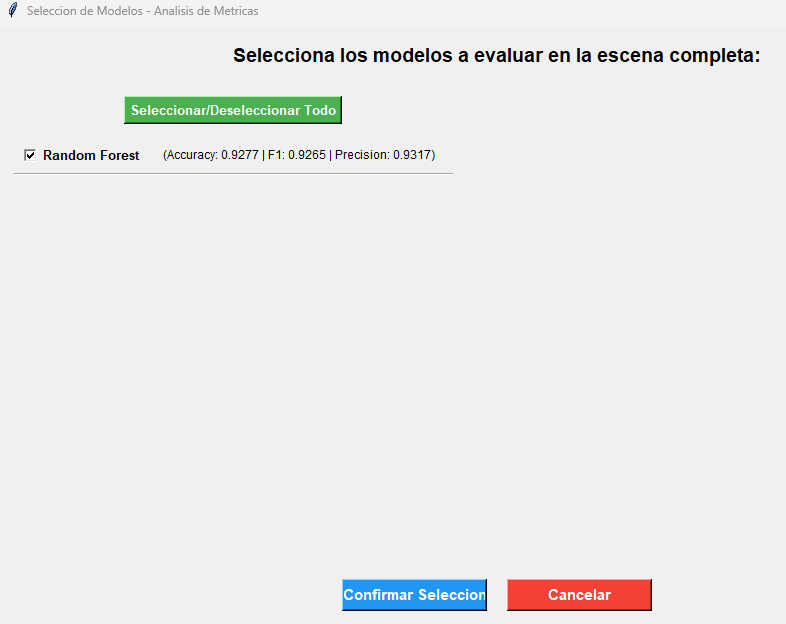

# Inferencia Espacial y Generacion de Mapas Cartograficos (Fase 3)

## 1. Descripcion General

La Fase 3 constituye la etapa de aplicacion e inferencia espacial masiva sobre la totalidad de la escena satelital (`complete_image.csv`). En esta etapa, los clasificadores de Machine Learning previamente entrenados y optimizados en la Fase 2 infieren la condicion de area quemada o no quemada pixel por pixel sobre la grilla raster completa.

Adicionalmente, esta fase realiza la georreferenciacion cartografica en el sistema de coordenadas geograficas WGS84 ($\text{Latitud}/\text{Longitud}$) y genera productos cartograficos de alta resolucion en formato PNG.

---

## 2. Diagrama de Arquitectura de la Fase 3



---

## 3. Descripcion de Modulos y Funcionalidades

### 1. Georreferenciacion y Conversion de Coordenadas (`src/visualization/geo_utils.py`)
- Convierte las coordenadas de matriz $(X, Y)$ a coordenadas geograficas WGS84 ($\text{EPSG:4326}$) mediante la matriz de transformacion afin (`geotransform`) extraida de la cobertura GeoTIFF de entrada con `rasterio` y `pyproj`.
- Formatea los ejes de los mapas cartograficos al formato academico estandar de grados y minutos (ejemplo: $42^\circ 09'\text{S}$, $71^\circ 32'\text{W}$).

### 2. Inferencia Masiva en Batch (`src/models/inference.py`)
- Carga los modelos optimizados `.pkl` y el objeto `StandardScaler` guardado durante la Fase 2.
- Aplica la transformacion `scaler.transform()` exclusivamente sobre las 20 columnas de caracteristicas de la escena completa.
- Computa las clases predichas $\hat{y} \in \{0, 1\}$ mediante `modelo.predict()` y las probabilidades continuas de pertenecia a la clase quemada $P(Y=1 | X)$ mediante `modelo.predict_proba()`.
- Exporta archivos tabulados `predicciones_<modelo>.csv`.

### 3. Generador de Mapas Cartograficos (`src/visualization/map_generator.py`)
- **Mapa de Clasificacion Binaria**: Renderiza el mapa final de clasificacion espacial:
  - **Verde**: Clase 0 (Superficie No Quemada).
  - **Rojo**: Clase 1 (Superficie Quemada).
- **Mapa de Intensidad de Probabilidad Continua**: Visualiza la severidad y la incertidumbre de la clasificacion utilizando una composicion RGB continua:
  - **Rojo Intenso**: Probabilidad alta de cicatriz de incendio ($P > 0.5$).
  - **Verde Intenso**: Probabilidad baja de cicatriz de incendio ($P \le 0.5$).
  - **Blanco**: Incertidumbre en la frontera de decision ($P \approx 0.5$).

---

## 4. Instrucciones de Ejecucion

El script orquestador `scripts/03_generate_classification_maps.py` gestiona la inferencia masiva y la generacion de mapas.

### Opcion A: Ejecucion Interactiva (Recomendado para uso general)

Al ejecutar el script sin parametros de linea de comandos:

```bash
python scripts/03_generate_classification_maps.py --incendio PONTON
```

**Flujo interactivo en consola y GUI**:
1. **Seleccion de la Prueba**: El script escanea la carpeta `results/models/` y despliega en la terminal las pruebas entrenadas disponibles. El operador selecciona interactivamente el nombre identificador de la prueba a evaluar.
2. **Seleccion de Modelos por Metricas**: Se abre la ventana interactiva Tkinter (`crear_interfaz_seleccion_modelos_metricas`) mostrando las metricas cuantitativas de cada modelo (Accuracy, F1-Score, Precision, etc.) para seleccionar cuales clasificadores ejecutaran la inferencia sobre la escena completa.

### 4.1. Interfaz Grafica de Seleccion de Modelos por Metricas (GUI Tkinter)

Durante el flujo interactivo de la Fase 3, el sistema presenta una ventana grafica que lee los resultados cuantitativos del archivo `metricas_holdout_todos_los_modelos.csv` de la prueba seleccionada. 

Esta interfaz muestra el rendimiento comparativo de cada algoritmo (Accuracy, F1-Score, Precision, AUC, Specificity) permitiendo al usuario seleccionar mediante checkboxes exactamente que modelos desea aplicar para la inferencia espacial masiva y la generacion de mapas.



### Opcion B: Ejecucion por Linea de Comandos (CLI / Headless)

Para automatizar la generacion de mapas sin intervencion manual:

```bash
python scripts/03_generate_classification_maps.py --incendio PONTON --prueba "Prueba Ponton GKF Spatial Holdout (Tesis)" --headless
```

---

## 5. Estructura de Productos Generados

Al finalizar la Fase 3, los archivos se almacenan dentro de la estructura de la prueba en `results/models/<Nombre_Prueba>/`:

```text
results/models/<Nombre_Prueba>/
├── clasificacion_<Nombre_Modelo>.png
├── clasificacion_con_intensidad_<Nombre_Modelo>.png
└── <Nombre_Modelo>/
    ├── <Nombre_Modelo>_modelo.pkl
    ├── predicciones_<Nombre_Modelo>.csv
    └── metricas_prueba.csv
```
