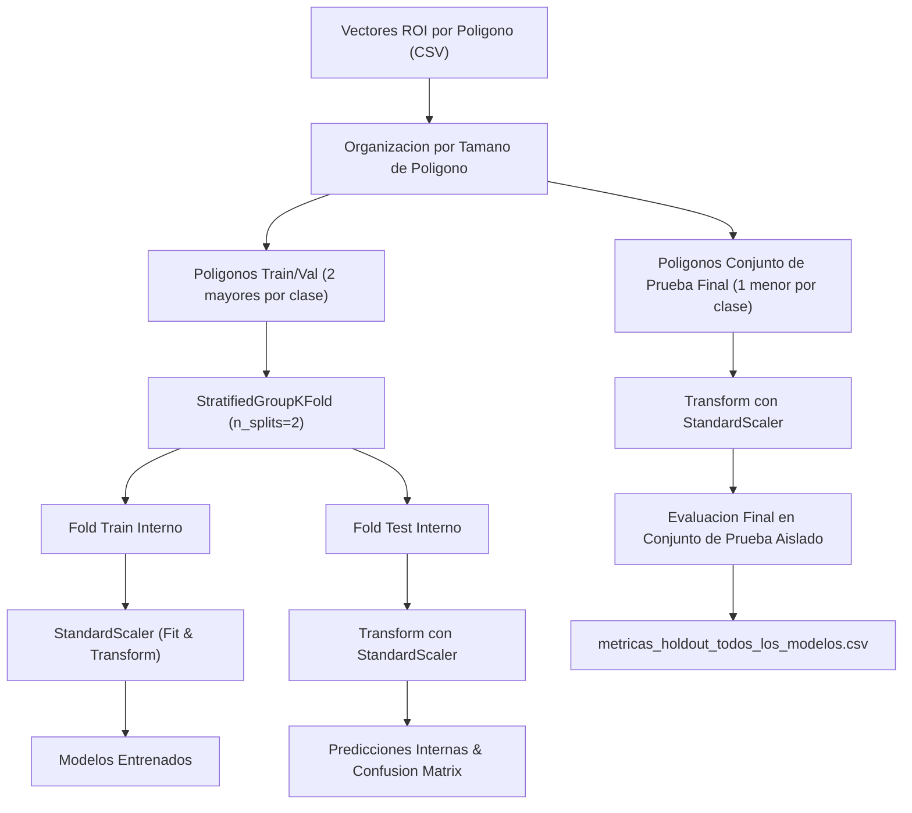
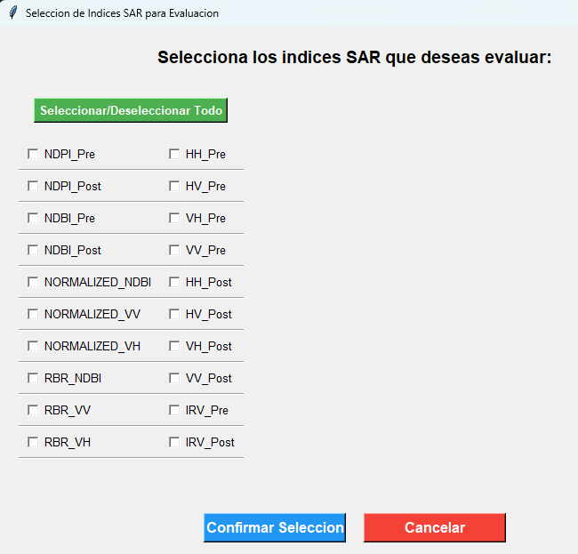
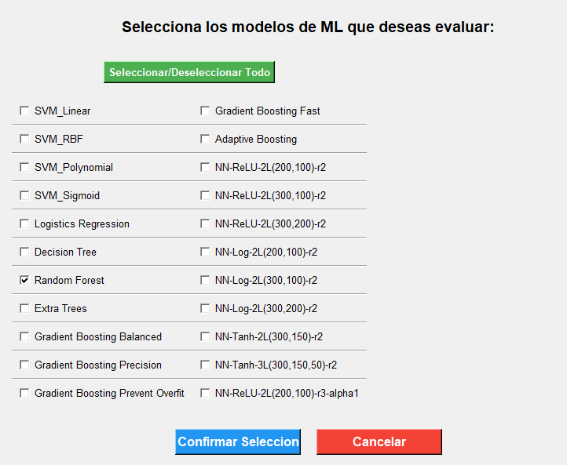

# Entrenamiento y Evaluacion de Modelos de Machine Learning (Fase 2)

## 1. Descripcion General
La Fase 2 comprende el flujo completo de entrenamiento, seleccion de caracteristicas, validacion cruzada por grupos espaciales (**StratifiedGroupKFold**) y evaluacion cuantitativa en un **Conjunto de Prueba Espacialmente Aislado**.

El objetivo es evaluar la capacidad de generalizacion de diversos modelos de Machine Learning (modelos lineales, arboles de decision, ensembles de boosting y redes neuronales perceptron multicapa) sobre datos SAR de Sentinel-1 sin incurrir en fuga de informacion espacial (*spatial data leakage*).

---

## 2. Diagrama de Arquitectura de Entrenamiento



---

## 3. Aislamiento Espacial por Poligonos (StratifiedGroupKFold)

Para evitar la sobreestimacion del rendimiento debida a la autocorrelacion espacial de los pixeles vecinos:
1. **Ordenamiento de Poligonos**: Se calcula el numero de pixeles de cada vector ROI de incendio (clase *Burned* y *Not Burned*).
2. **Asignacion de Grupos**:
   - **Entrenamiento y Validacion Interna**: Se seleccionan los 2 poligonos mas grandes de cada clase (Q1, Q2, NQ1, NQ2) para maximizar la variabilidad espectral en el entrenamiento.
   - **Conjunto de Prueba Espacial Final**: Se asignan los poligonos mas pequenos de cada clase (Q3, NQ3) exclusivamente para la evaluacion final sin contacto previo durante la optimizacion de modelos.
3. **Escalado de Caracteristicas**: `StandardScaler` se ajusta (`fit`) **unicamente** con las muestras de `X_train`. Las muestras de `X_test` y `X_holdout` (conjunto de prueba) se transforman utilizando la media y desviacion estandar del entrenamiento.

---

## 4. Registro de Modelos Evaluados

| Nombre del Modelo | Familia Algoritmica | Hiperparametros Destacados |
| :--- | :--- | :--- |
| `SVM_Linear` | Support Vector Machine | Kernel lineal, `probability=True` |
| `SVM_RBF` | Support Vector Machine | Kernel RBF (gaussiano), `probability=True` |
| `SVM_Polynomial` | Support Vector Machine | Kernel polinomico (grado 3) |
| `SVM_Sigmoid` | Support Vector Machine | Kernel sigmoide |
| `Logistics Regression` | Modelo Lineal | `max_iter=1000`, solucionador L-BFGS |
| `Decision Tree` | Arbol de Decision | Criterio Gini / Entropia |
| `Random Forest` | Ensemble (Bagging) | `n_estimators=100` |
| `Extra Trees` | Ensemble (Randomized Trees) | `n_estimators=100` |
| `Gradient Boosting Balanced` | Ensemble (Boosting) | `n_estimators=150`, `learning_rate=0.1`, `max_depth=5` |
| `Gradient Boosting Precision` | Ensemble (Boosting) | `n_estimators=300`, `learning_rate=0.05`, `max_depth=6` |
| `Gradient Boosting Fast` | Ensemble (Boosting) | `n_estimators=100`, `learning_rate=0.15`, `max_depth=3` |
| `Gradient Boosting Prevent Overfit` | Ensemble (Boosting) | `n_estimators=200`, `learning_rate=0.075`, `max_depth=4` |
| `Adaptive Boosting` | Ensemble (Boosting) | `n_estimators=100` |
| `NN-ReLU-2L(200,100)-r2` | Red Neuronal MLP | 2 capas ocultas (200, 100), activacion ReLU, optimizador Adam |
| `NN-Log-2L(200,100)-r2` | Red Neuronal MLP | 2 capas ocultas (200, 100), activacion Sigmoide (Logistic) |
| `NN-Tanh-2L(300,150)-r2` | Red Neuronal MLP | 2 capas ocultas (300, 150), activacion Tanh |

### 4.1. Menus Interactivos de Seleccion (GUI Tkinter)

Durante la ejecucion interactiva del script `scripts/02_train_and_evaluate.py`, el sistema despliega dos ventanas graficas consecutivas construidas con Tkinter para que el operador seleccione de manera intuitiva los componentes del experimento:

#### 1. Seleccion de Indices Espectrales SAR
Permite marcar individualmente cuales de los 20 indices SAR calculados se incluiran como predictores. Incluye boton de seleccion masiva (*Seleccionar/Deseleccionar Todo*).



#### 2. Seleccion de Modelos de Machine Learning
Permite elegir los algoritmos a entrenar y evaluar en la prueba actual. Cada modelo seleccionado generara de forma automatica su respectivo archivo `.pkl`, grafico de matriz de confusion en porcentaje, grafico de importancias de caracteristicas y metricas cuantitativas.



---

## 5. Metricas Cuantitativas Calculadas

Para cada modelo se calculan y persisten las siguientes metricas sobre el conjunto de validacion interna y Conjunto de Prueba:

1. **Accuracy**: Proportion de predicciones correctas sobre el total de muestras.
   $$\mathrm{Accuracy} = \frac{TP + TN}{TP + TN + FP + FN}$$
2. **Precision**: Proporcion de verdaderos positivos sobre el total de predicciones positivas.
   $$\mathrm{Precision} = \frac{TP}{TP + FP}$$
3. **Recall (Sensibilidad)**: Proporcion de verdaderos positivos detectados correctamente.
   $$\mathrm{Recall} = \frac{TP}{TP + FN}$$
4. **F1-Score**: Media armonica ponderada entre Precision y Recall.
   $$\mathrm{F1} = 2 \times \frac{\mathrm{Precision} \times \mathrm{Recall}}{\mathrm{Precision} + \mathrm{Recall}}$$
5. **Specificity (Especificidad)**: Tasa de verdaderos negativos en la clase no quemada.
   $$\mathrm{Specificity} = \frac{TN}{TN + FP}$$
6. **AUC (Area Bajo la Curva ROC)**: Capacidad de discriminacion entre clases basada en probabilidades continuas.

---

## 6. Ejecucion del Script Orquestador

Para ejecutar la Fase 2 desde la linea de comandos:

```bash
# Modo interactivo (interfaz Tkinter para seleccion de caracteristicas y modelos)
python scripts/02_train_and_evaluate.py --incendio PONTON

# Modo no interactivo (Headless / Integracion Continua)
python scripts/02_train_and_evaluate.py --incendio PONTON --headless
```

Los artefactos generados se organizan en la estructura:
```
results/models/<Nombre_Prueba>/
├── dataset_dividido/
│   ├── scaler.pkl
│   ├── datos_entrenamiento.pkl
│   ├── datos_test.pkl
│   └── datos_holdout.pkl
├── <Nombre_Modelo>/
│   ├── <Nombre_Modelo>_modelo.pkl
│   ├── <Nombre_Modelo>_confusion_matrix.png
│   ├── <Nombre_Modelo>_feature_importances.png
│   ├── predicciones_basicas.pkl
│   └── metricas_prueba.csv
└── metricas_holdout_todos_los_modelos.csv
```
