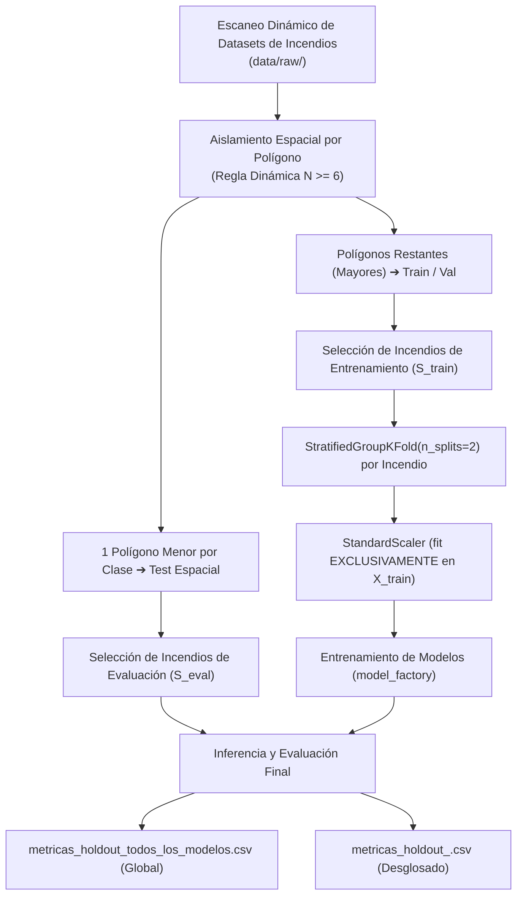
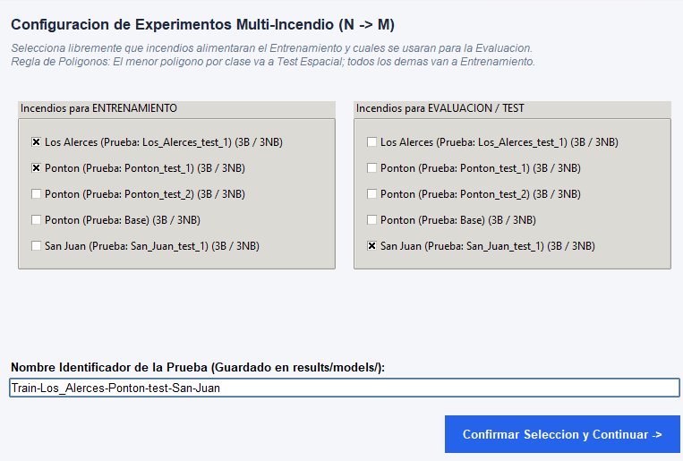
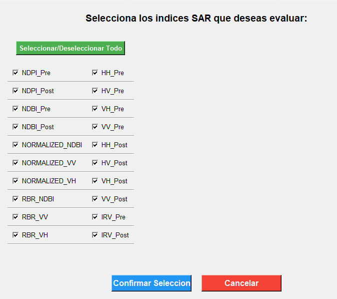
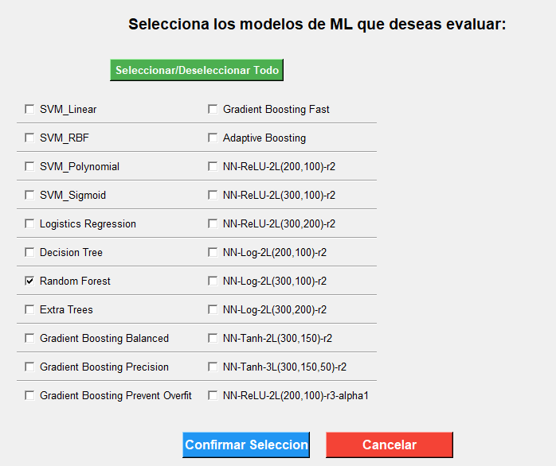

# Entrenamiento Multi-Incendio y Transferencia Cruzada Inter-Bioma (Fase 4)

## 1. Descripción General

La **Fase 4 / Step 4** (`scripts/04_multi_fire_training.py`) extiende las capacidades del pipeline para realizar experimentos de **Transferencia Cruzada** y **Modelos Globales Multi-Incendio ($N \to M$)**.

Esta arquitectura permite seleccionar libremente qué incendios se utilizarán para el entrenamiento y cuáles se utilizarán para la evaluación cuantitativa sin contacto previo durante la optimización.

---

## 2. Diagrama de Arquitectura de la Fase 4



---

## 3. Principios Metodológicos

### 1. Regla Dinámica de Selección de Polígonos ($N \ge 6$)
Para garantizar el aislamiento espacial y la validez estadística:
- Cada incendio requiere un mínimo de **6 polígonos** (3 *Burned* y 3 *Not Burned*).
- Se ordena cada clase por cantidad de píxeles (tamaño).
- El polígono de **menor tamaño** de cada clase ($Q_{\text{menor}}$ y $NQ_{\text{menor}}$) se reserva para el **Conjunto de Prueba Espacial** (2 polígonos por incendio).
- **Todos los demás polígonos** ($\ge 4$ polígonos mayores) se asignan al pozo de **Entrenamiento/Validación**.

### 2. Aislamiento Estricto y Prevención de Fuga de Información
- `StandardScaler.fit()` se ejecuta **únicamente** con las muestras de $X_{\text{train}}$ resultantes de la combinación de los incendios seleccionados para entrenamiento ($S_{\text{train}}$).
- Los conjuntos de prueba espacial de los incendios evaluados ($S_{\text{eval}}$) se transforman utilizando exclusivamente `scaler.transform()`.

---

## 4. Instrucciones de Ejecución y Flujo Gráfico

### Opción A: Ejecución Interactiva con GUI Tkinter (Recomendado)

Al ejecutar el script sin argumentos de línea de comandos:

```bash
python scripts/04_multi_fire_training.py
```

El sistema desplegará secuencialmente tres interfaces gráficas para la configuración completa del experimento:

#### 4.1. Selección de Incendios y Nombre de la Prueba
En esta primera interfaz se especifican los roles de cada dataset disponible en el sistema (detectados automáticamente en `data/raw/` o carpetas de pruebas):
- **Incendios para ENTRENAMIENTO**: Selección de los incendios cuyos polígonos de mayor tamaño alimentarán el ajuste del modelo y la validación cruzada interna.
- **Incendios para EVALUACIÓN / TEST**: Selección de los incendios cuyos polígonos menores aislados serán evaluados por el modelo entrenado (permitiendo pruebas en biomas no vistos).
- **Nombre Identificador de la Prueba**: Campo de entrada de texto para definir la subcarpeta de destino dentro de `results/models/<Nombre_Prueba>/` que alojará los clasificadores `.pkl` y reportes.



#### 4.2. Selección de Características e Índices Espectrales SAR
Permite filtrar interactivamente qué bandas primarias de retrodispersión ($\text{VV}_{\text{Pre}}, \text{VH}_{\text{Pre}}, \text{VV}_{\text{Post}}, \text{VH}_{\text{Post}}$, etc.) e índices espectrales derivados ($\text{IRV}, \text{NDPI}, \text{NDBI}, \text{RBR}, \text{Normalized}$) conformarán las columnas de características de entrada a los clasificadores.



#### 4.3. Selección de Algoritmos de Aprendizaje Automático
Permite seleccionar mediante checkboxes exactamente qué modelos de Machine Learning (SVM, Logistic Regression, Arboles de Decisión, Random Forest, Extra Trees, Gradient Boosting, MLP Neural Networks) serán entrenados y evaluados en el experimento.



---

### Opción B: Ejecución por Línea de Comandos (CLI / Headless)

Para automatizar experimentos desatendidos o integraciones en scripts batch:

```bash
# Ejemplo: Transferencia Cruzada (Entrenar con Pontón y San Juan, probar en Los Alerces)
python scripts/04_multi_fire_training.py --train-incendios PONTON SAN_JUAN --test-incendios LOS_ALERCES --prueba "Transferencia_Cruzada_LosAlerces" --headless

# Ejemplo: Modelo Global Multi-Incendio (Entrenar con todos, probar en todos)
python scripts/04_multi_fire_training.py --train-incendios PONTON LOS_ALERCES SAN_JUAN --test-incendios PONTON LOS_ALERCES SAN_JUAN --prueba "Modelo_Global_Tesis" --headless
```

---

## 5. Estructura de Productos Generados

Al finalizar el Step 4, los resultados se almacenan en `results/models/<Nombre_Prueba>/`:

```text
results/models/<Nombre_Prueba>/
├── metricas_holdout_todos_los_modelos.csv   # Métricas evaluadas sobre el conjunto combinado
├── metricas_holdout_PONTON.csv               # Métricas desglosadas para el incendio Pontón
├── metricas_holdout_LOS_ALERCES.csv          # Métricas desglosadas para el incendio Los Alerces
├── metricas_holdout_SAN_JUAN.csv             # Métricas desglosadas para el incendio San Juan
├── dataset_dividido/
│   ├── scaler.pkl
│   ├── datos_entrenamiento.pkl
│   ├── datos_test.pkl
│   └── datos_holdout.pkl
└── <Nombre_Modelo>/
    ├── <Nombre_Modelo>_modelo.pkl
    ├── <Nombre_Modelo>_confusion_matrix.png
    └── <Nombre_Modelo>_feature_importances.png
```
